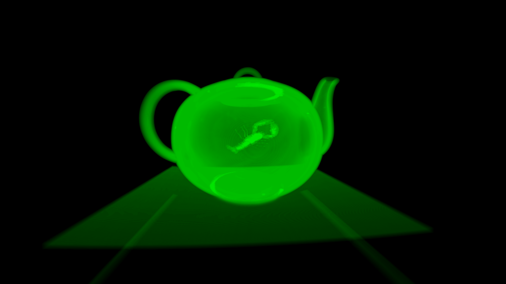
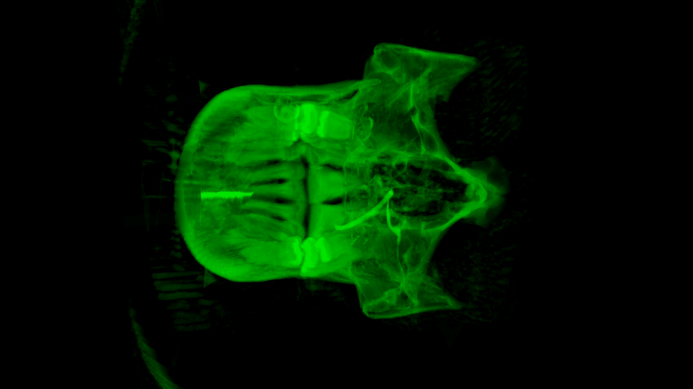
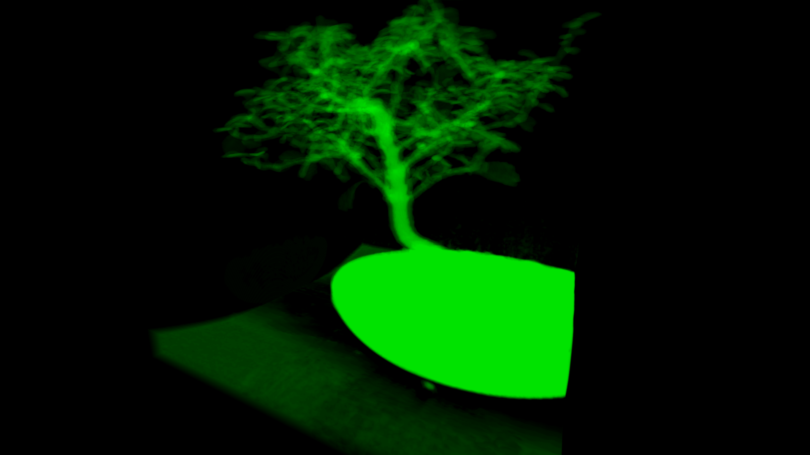

# Voxcube

**Voxcube** is a small program for rendering density maps. Density maps
are just raw files containing density samples (unsigned integer
values, one or more bytes per sample) on a Cartesian grid which covers
a unit cube. Samples are encoded in a sequential slice-by-slice
order. Bigger values of a sample designate more opaque material at
that point and smaller values designate more transparent
material. There must be a small JSON file with information about size
of a density map on each dimension, possibly the size of a sample in
bytes (default is 1 byte per sample) and the name of a density map to
run the program. See `examples` for more info.

## Dependencies

* CMake for building.
* OpenGL
* [GLM](https://glm.g-truc.net/0.9.9/index.html)

## Building

Run the following commands from this directory (this will do
system-wide installation of **voxcube**):

~~~~
mkdir build
cd build
cmake -DCMAKE_BUILD_TYPE=RELEASE ..
make
make install # Root required
~~~~

If you do not want to install **voxvision** system-wide, you can do
the following:

~~~~
mkdir build
cd build
cmake -DCMAKE_BUILD_TYPE=RELEASE -DSYSTEM_WIDE=OFF ..
make
~~~~

and run `voxcube` binary from the directory which contains `shaders/`
subdirectory.

## Running

Running `voxcube` is straightforward: `voxcube -c cfg.json` where
`cfg.json` is a configuration file which describes your density map.

### Controls

* `WASD` move the camera.
* Rotate the camera with mouse.
* `P` increase density threshold (just press it one or two times to
  see what it means).
* `O` descrease density threshold.

## Examples

`examples/` directory contains some density maps and configuration
files to play with. For example, try
`voxcube -c /path/to/examples/bonsai.json`.

## Legal issues

All examples were taken from open sources on the net long time
ago. I do not even remember from where and I cannot credit the
authors. If you are holding the rights for them and want to be
credited for your work, please open an issue. Also I can remove these
examples if you do not want me to share them.

## Renderings

